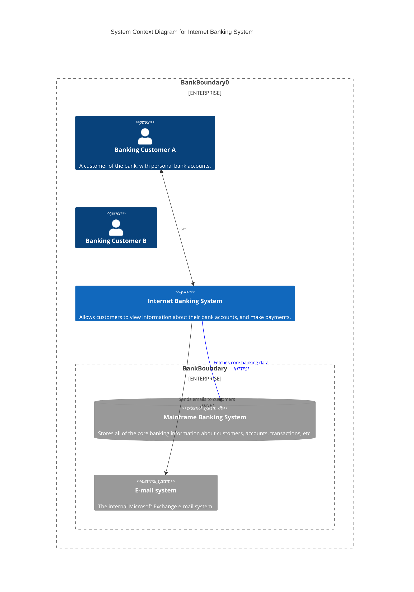

# C4 Model: Context Diagram

Context diagrams provide an overview of the entire system and its interaction with external actors. They help in understanding the relationship between a system and its environment.

## Example of a Context Diagram
