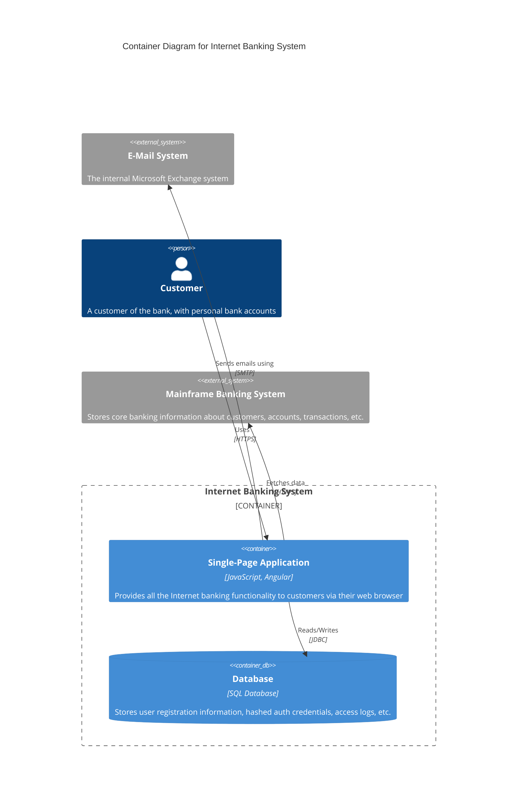

# C4 Model: Container Diagram

The **Container Diagram** provides a deeper view of the internal structure of the system by illustrating the main containers or components and their relationships. Containers can be applications, services, databases, or other subsystems.

