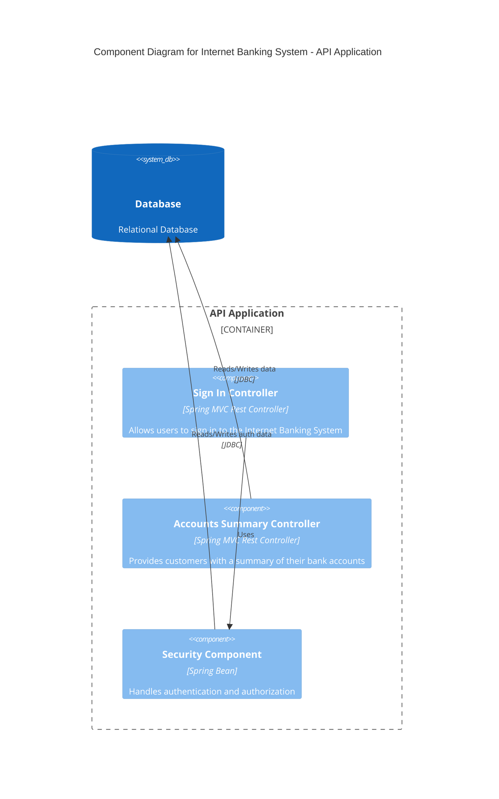

# C4 Model: Component Diagram

The **Component Diagram** provides an in-depth view of a single container, breaking it down into individual components and their interactions. Components typically include classes, services, and other logical units within a container.

