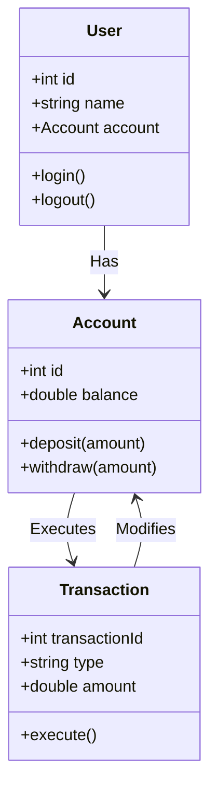

# C4 Model: Code Diagram

The **Code Diagram** provides the lowest-level view of the system's design, focusing on the class structure and their relationships. It represents the implementation details of components.

At this level any diagram is allowed, and probably welcome. I'd go for UML or UML-like diagrams (i.e.: a combination of componetns and itneraction diagrams)