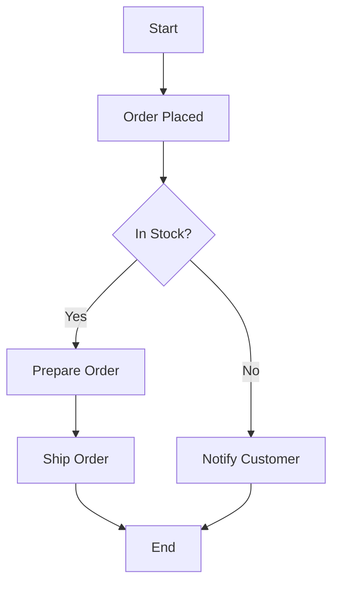

# Activity Diagram: Basic Concepts

Activity diagrams are used to describe the flow of control in a system, showing how different activities are coordinated.

## Activity Diagram: Order Fulfillment Process

## Explanation

- Order Placed: The process starts when an order is placed.
- In Stock?: Checks if the item is available.
- Prepare Order: Prepares the order for shipping if in stock.
- Notify Customer: Notifies the customer if the item is out of stock.
- Ship Order: Ships the order and ends the process.

This diagram is useful for visualizing a decision-making process.