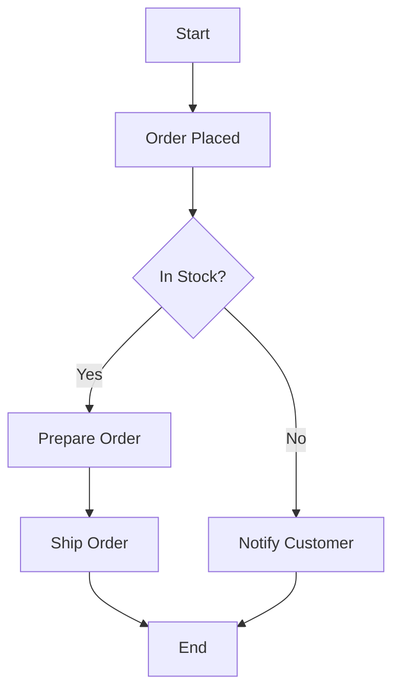
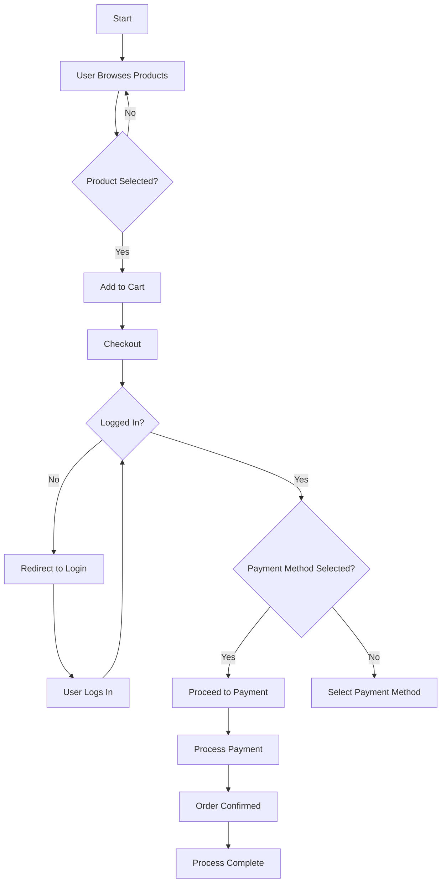
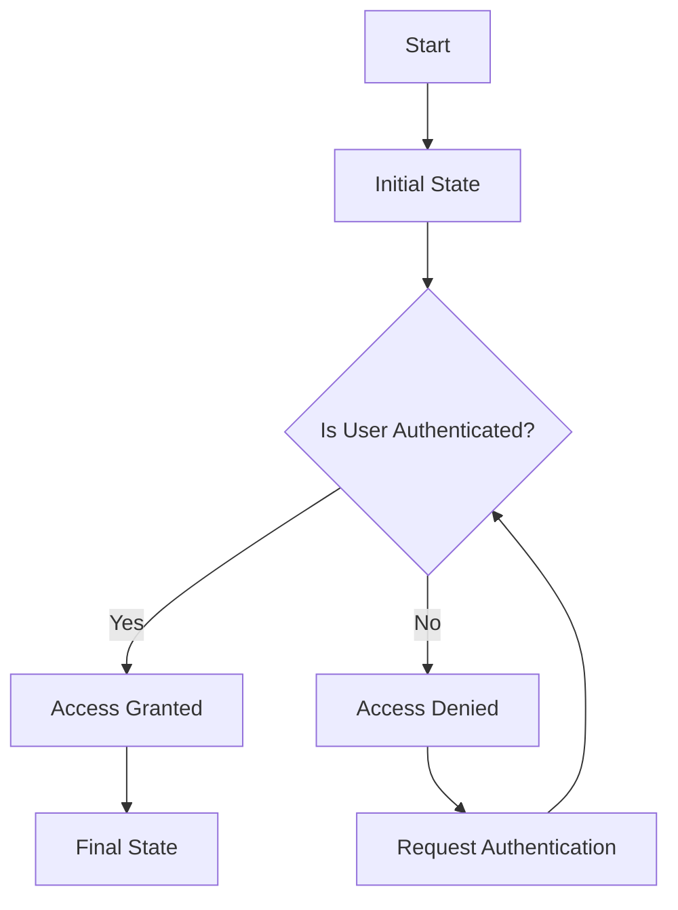
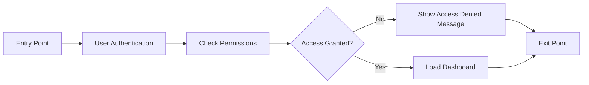
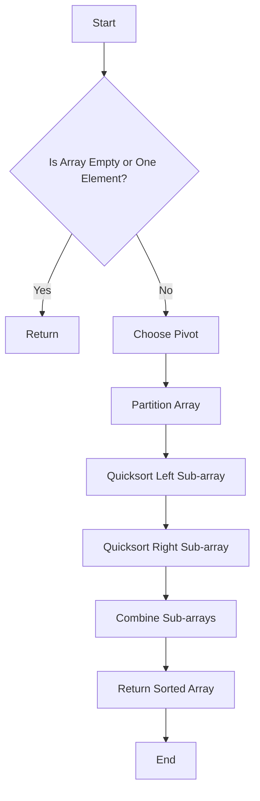
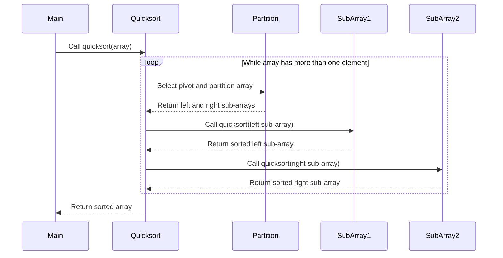
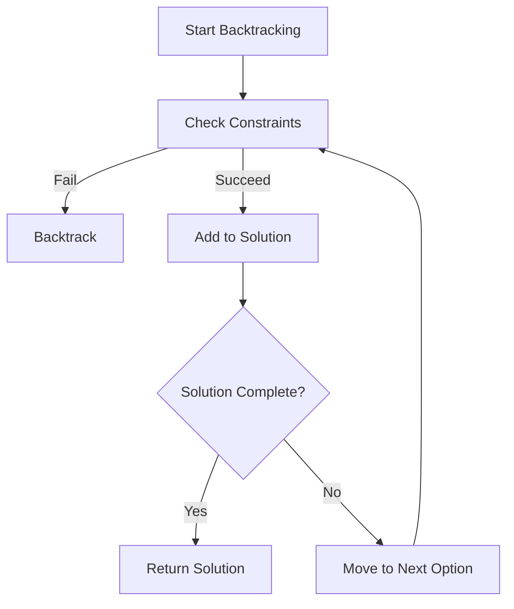
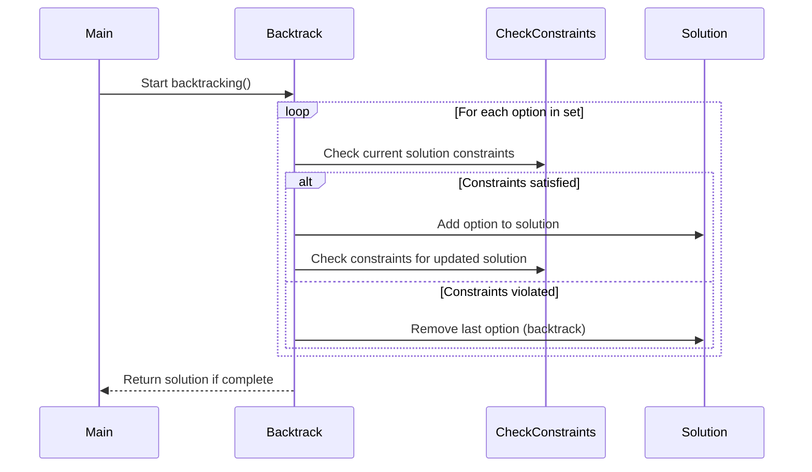

# Activity Diagram: Basic Concepts

Activity diagrams are used to describe the flow of control in a system, showing how different activities are coordinated.

# NOTE:
Mermaid does not have a specific type of diagram for representing activity diagrams exactly as defined in UML. However, it is possible to approximate activity diagrams using Mermaid's `flowchart` syntax to represent the flow of control. Some UML-specific elements like "decision nodes," "forks," and "swimlanes" may not be supported directly or may require creative workarounds.

## Activity Diagram: Order Fulfillment Process

## Explanation

- Order Placed: The process starts when an order is placed.
- In Stock?: Checks if the item is available.
- Prepare Order: Prepares the order for shipping if in stock.
- Notify Customer: Notifies the customer if the item is out of stock.
- Ship Order: Ships the order and ends the process.

This diagram is useful for visualizing a decision-making process.

# Activity Diagram: Advanced Concepts

Activity diagrams can also include additional elements like entry/exit points, forks, and joins. Here's an example demonstrating these concepts:

## Activity Diagram: E-commerce Order Process with Forks and Joins

## Explanation
- **Start:** Represents the initial state of the process.
- **Product Selected?:** Decision node to check if a product is selected.
- **Fork:** Payment processing steps occur in parallel (omitted here for simplicity).
- **End:** Represents the final state of the process.

## Key Concepts Included:
1. Entry/Exit Points: Represented using the "Start" and "End" nodes.
1. Decision Nodes: Used for branching the flow based on conditions (Yes/No paths).
1. Fork and Join: Can be simulated by breaking the flow into parallel branches using separate paths.

## Alternatives to Decision Nodes and Forks in Mermaid
Although Mermaid does not have direct support for elements such as decision nodes or branching points that are standard in UML diagrams, diamond nodes or conditional text labels can be used to simulate them.

## Adding Entry and Exit Nodes to Activity Diagrams in Mermaid
If you want to add explicit entry and exit points, you can use the following conventions in Mermaid:

# Explaining Algorithms with Activity Diagrams
When we want to explain algorithms like Quicksort or Backtracking, Activity  and Sequence Diagrams can be used to illustrate the flow of an algorithm effectively. Below is an explanation of these two well-known algorithms with its respective activity diagram representation:

## 1. Quicksort Algorithm
Description: Quicksort is a divide-and-conquer sorting algorithm. It works by selecting a 'pivot' element from the array and partitioning the other elements into two sub-arrays, according to whether they are less than or greater than the pivot. The sub-arrays are then sorted recursively.

### Step-by-Step Explanation:

1. Choose a pivot element from the array.
1. Partition the array into two sub-arrays: elements less than the pivot and 1. elements greater than the pivot.
1. Recursively apply the same steps to each sub-array.
1. Combine the sub-arrays and the pivot to get the sorted array.

### Best Diagram for Quicksort:

**Activity Diagram:** It can represent the flow of the sorting process.

#### Explanation
- Start: Start of the Quicksort process.
- Is Array Empty or One Element?: Base condition to stop the recursion.
- Choose Pivot: Select a pivot to divide the list.
- Partition Array: Separation of elements smaller and larger than the pivot.
- Quicksort Left/Right Sub-array: Recursive calls to Quicksort on the sub-arrays.
- Combine Sub-arrays: Unification of the results of the recursive calls.
- Return Sorted Array: Return of the sorted array.

**Sequence Diagram:** It can show the interaction between recursive calls.

#### Explanation
The loop shows that the quicksort function is called recursively as long as the array has more than one element. Each call partitions the array into left and right sub-arrays, which are also recursively sorted.

## 2. Backtracking Algorithm
Description: Backtracking is an algorithmic paradigm used to solve constraint satisfaction problems, such as Sudoku, N-Queens, and other puzzles. It incrementally builds a solution and removes those solutions that fail to satisfy the constraints.

### Step-by-Step Explanation:

Start with an empty solution.
Add an element to the solution if it doesn't violate the constraints.
If the constraints are violated, backtrack and remove the last added element.
Continue this process until all constraints are satisfied or all options are exhausted.

### Best Diagram for Backtracking:

**Activity Diagram:** It can represent the branching and backtracking flow.

**Sequence Diagram:** It can show the sequence of choices and backtracking steps.

#### Explanation
The loop indicates that backtracking iterates over each option in a set, checking constraints, adding or removing options based on whether the constraints are satisfied or violated, and continuing until a complete solution is found.