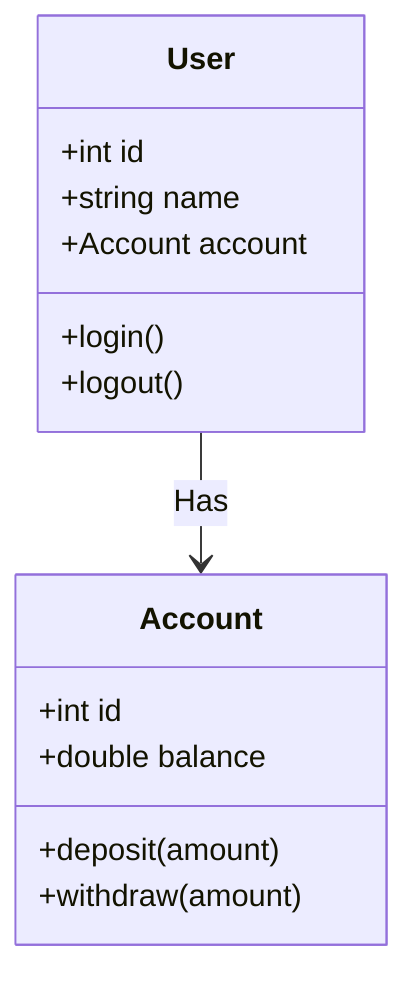

# Class Diagram: Basic Concepts

Class diagrams are one of the main tools to model the static structure of a system. They represent classes, attributes, methods, and relationships between them.

## Class Diagram: User and Account Relationship

## Explanation
- User: Represents a user in the system.
- Account: Represents a bank account.
- Relationship: User has a relationship of aggregation with Account.

Feel free to modify this example and experiment with more relationships, attributes, and class details according to your system needs.

