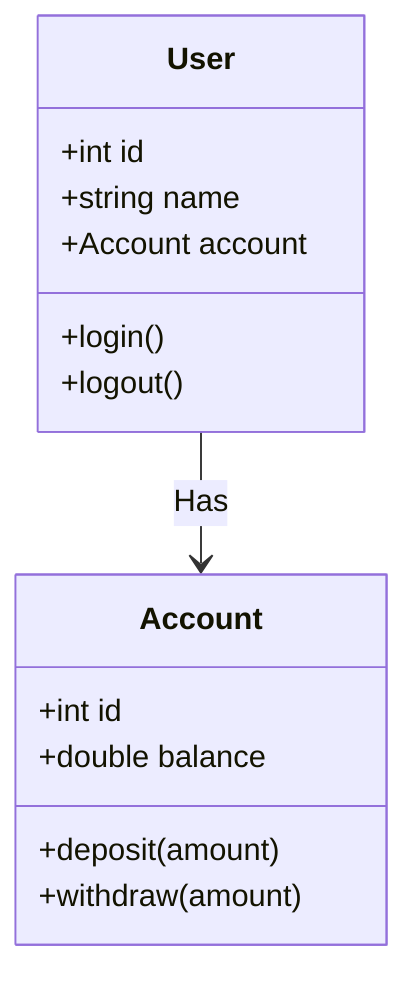
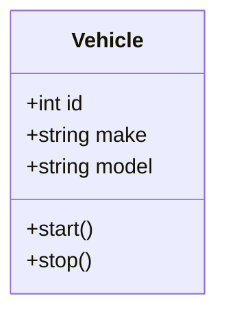
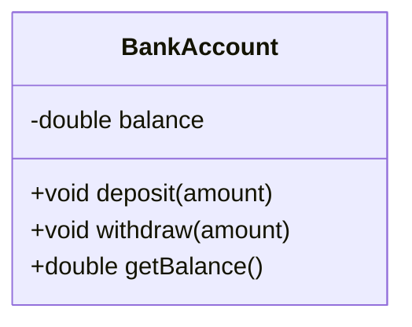
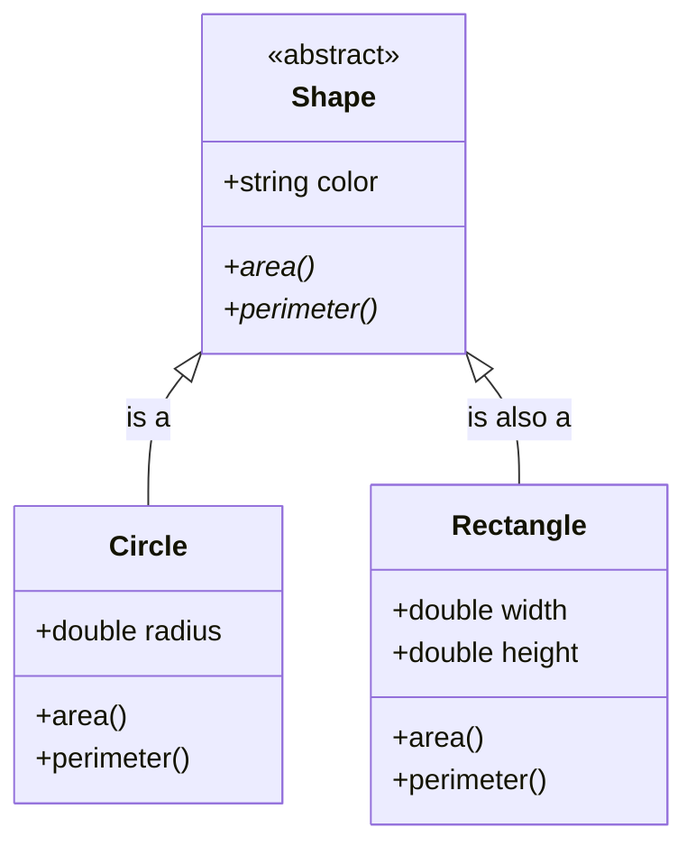
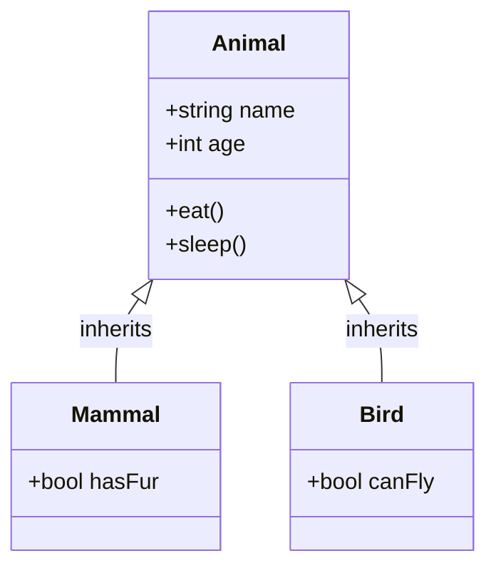
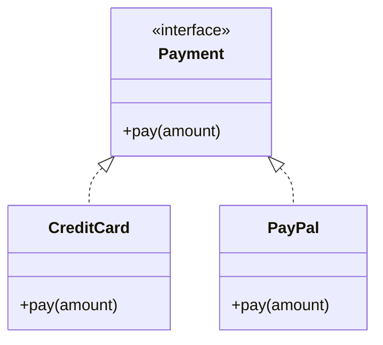
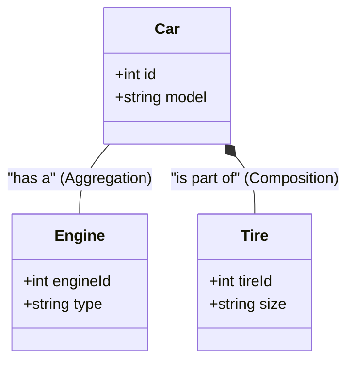
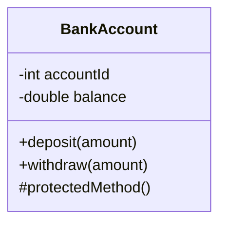

# OOP Fundamentals with Mermaid

## 1. Classes and Objects

Classes serve as blueprints for creating objects, while objects are instances of those classes.

### Diagram: User and Account Relationship

## Explanation:

- **User**: Represents a user in the system.
- **Account**: Represents a bank account.
- **Relationship**: User has an aggregation relationship with Account.

# 2. Attributes and Methods
Attributes define the state of an object, while methods define the behavior.

**Diagram**: Vehicle Class with Attributes and Methods

## Explanation:
- **Attributes**: id, make, and model.
- **Methods**: start() and stop() define actions the Vehicle can perform.

# 3. Encapsulation
Encapsulation restricts access to certain components of an object.

**Diagram**: Bank Account with Encapsulation

## Explanation:
balance is private, ensuring it can only be accessed or modified through methods deposit(), withdraw(), and getBalance().

# 4. Abstraction
Abstraction allows defining essential characteristics of an object without detailing its implementation.

**Diagram**: Abstract Shape Class

## Explanation:
- **Shape** is an abstract class with abstract methods area() and perimeter().
- **Circle** and Rectangle inherit from Shape and implement these methods.

5. Inheritance
Inheritance allows a class (subclass) to inherit attributes and methods from another class (superclass).

*Diagram*: Animal Inheritance

## Explanation:
Animal is the parent class with general properties and behaviors.
Mammal and Bird inherit from Animal and add unique attributes.

# 6. Polymorphism
Polymorphism allows different classes to respond to the same method call in different ways.

**Diagram**: Payment System with Polymorphism

## Explanation:
Payment is an interface with a pay() method.
CreditCard and PayPal implement Payment and define their own pay() methods.

7. Class Relationships
**Diagram**: Association, Aggregation, and Composition

## Explanation:
- ****Aggregation**: Car has an Engine (the engine can exist independently).
- ****Composition**: Car is composed of Tire (tires are part of a car and share its lifecycle).

8
. Access Modifiers

Access modifiers control access to the attributes and methods of a class.

**Diagram**: Bank Account with Access Modifiers

## Explanation:
- **public**: deposit() and withdraw() methods are accessible by anyone.
- **private**: accountId and balance can only be accessed within the class.
- **protected**: protectedMethod() is accessible within the class and subclasses.

