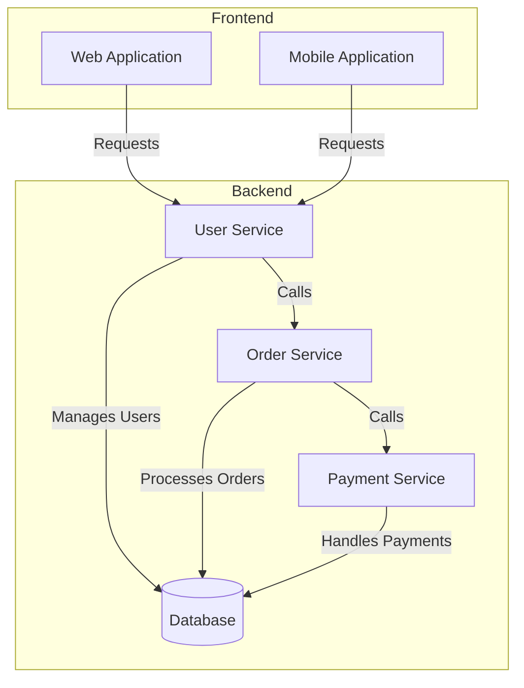

# Component Diagrams: Basic Concepts

Component diagrams are used to show the structure of a software system, including how components are connected and interact with each other.

## Component Diagram: E-commerce Application

## Explanation

- **Web Application and Mobile Application:** Represent the frontend systems where users interact.
- **User Service:** Manages user-related data.
- **Order Service:** Processes user orders.
- **Payment Service:** Manages payment processing.
- **Database:** Central storage for all services.

Use component diagrams to better understand the internal structure and dependencies of your system.