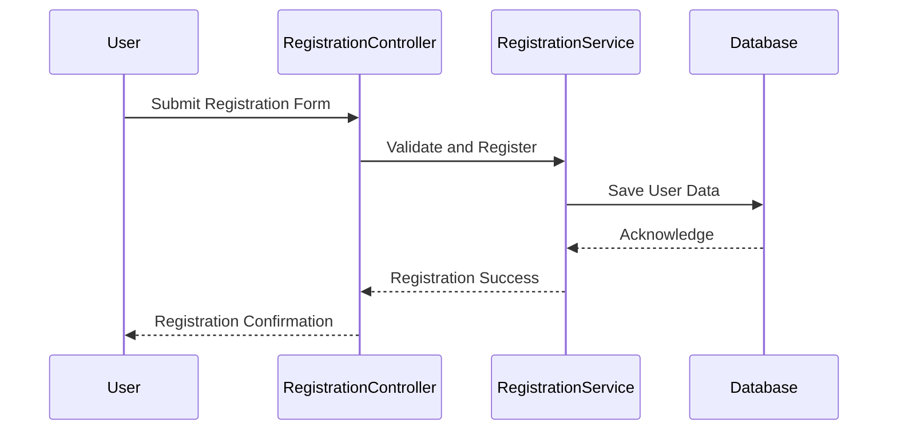
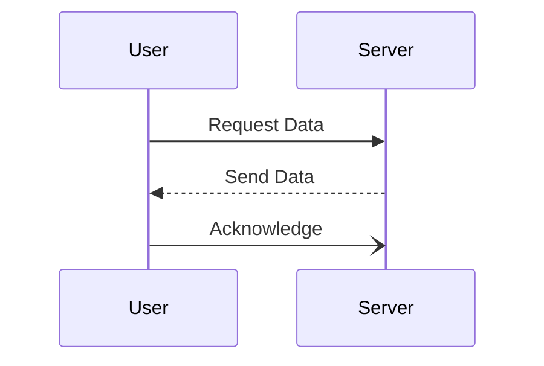
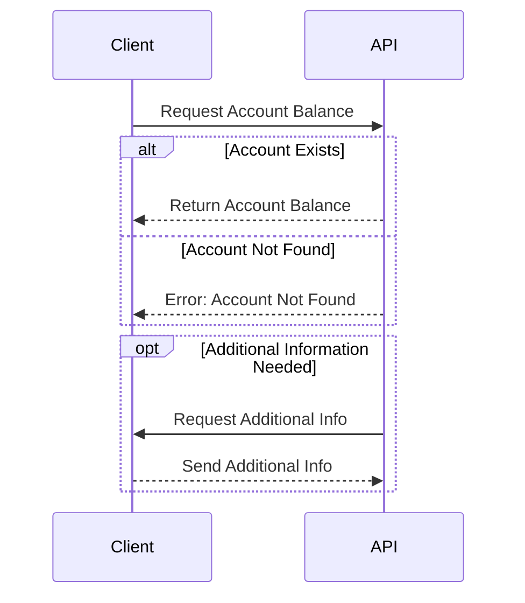
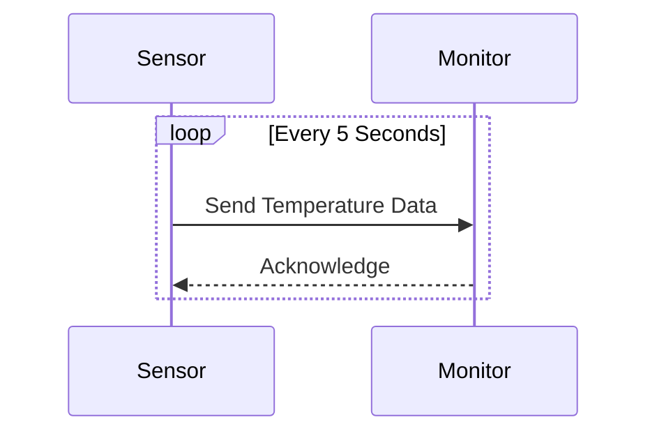
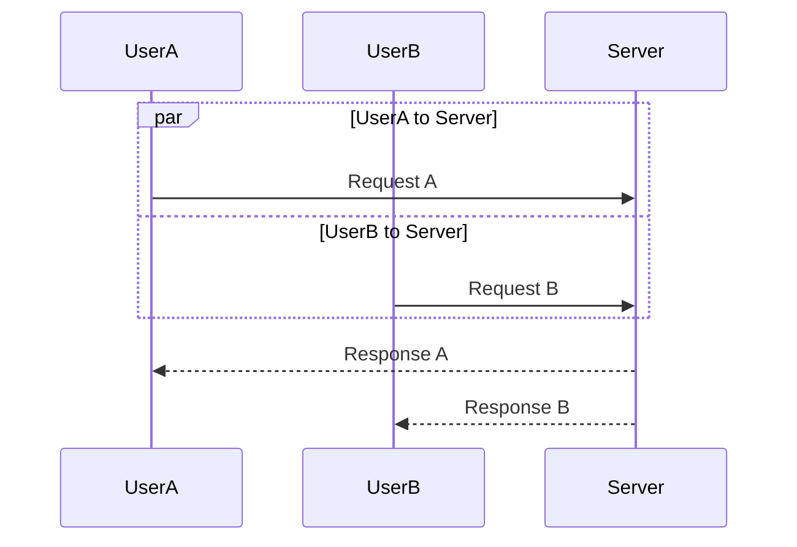
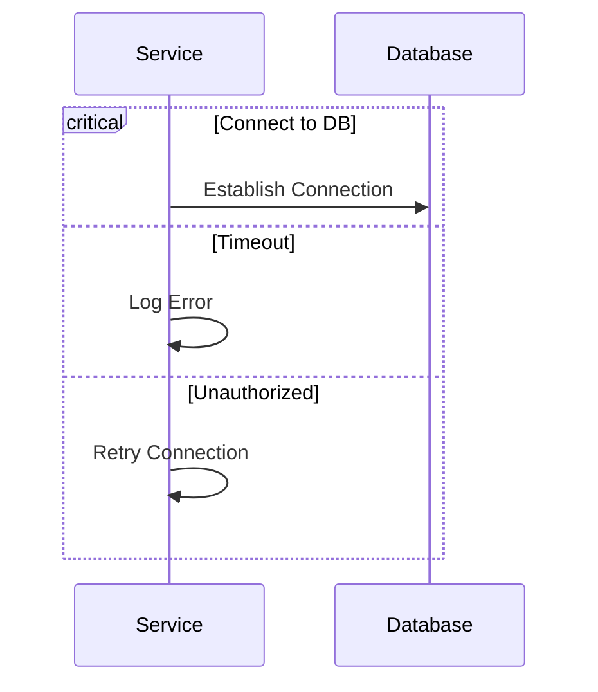
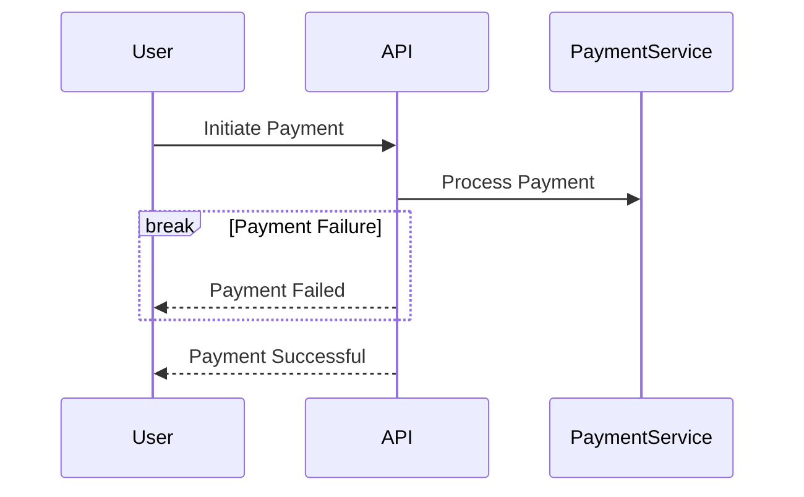
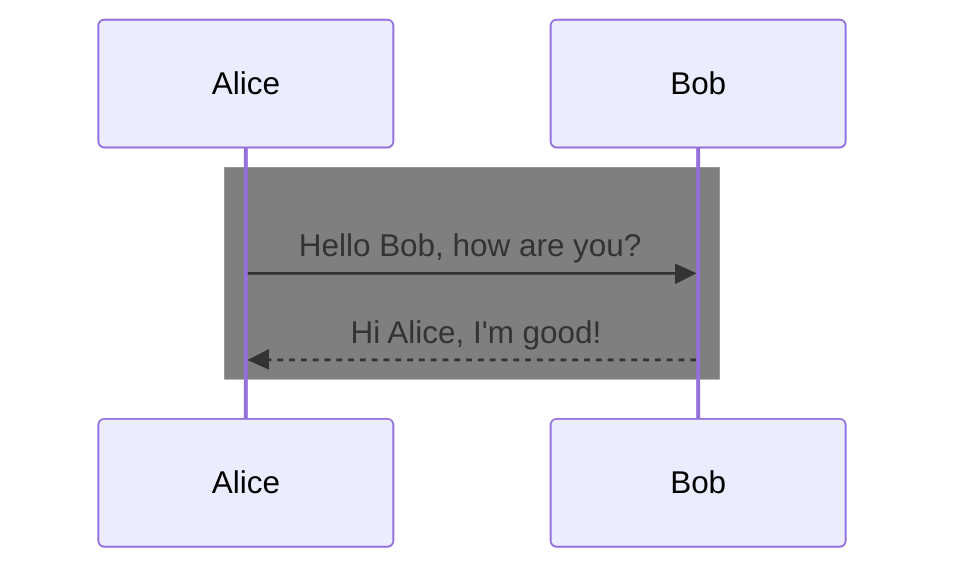
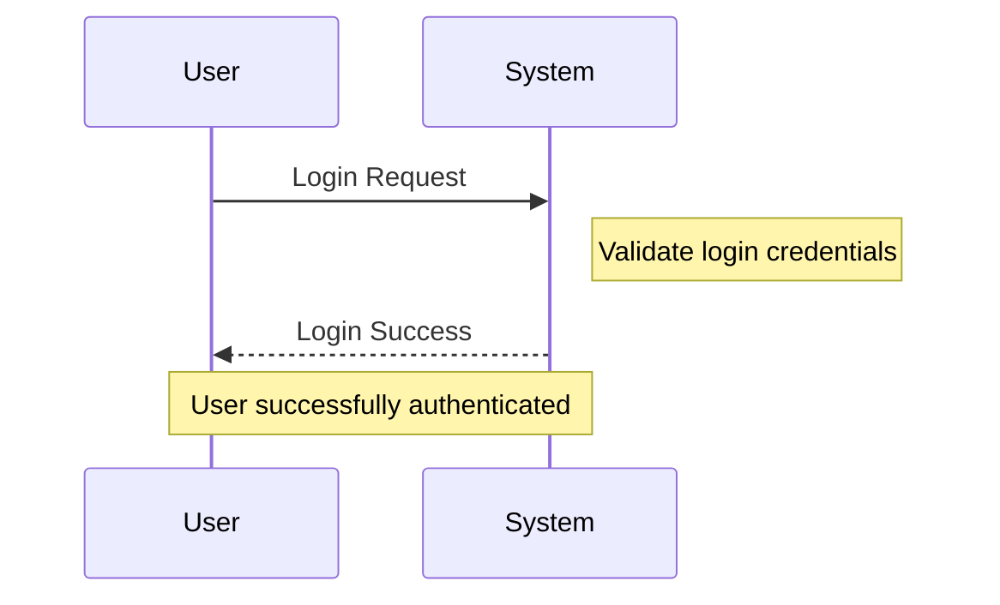

#### Content for `sequence-diagram-basics.md`

# Sequence Diagram: Basic Concepts

Sequence diagrams illustrate how different objects interact in a given scenario of a system over time. They show the sequence of messages exchanged between various objects.

## Sequence Diagram: User Registration Flow

## Explanation

- User: Initiates the registration process by submitting a form.
- RegistrationController: Manages the user request and sends it to the service.
- RegistrationService: Validates and processes the registration.
- Database: Persists the user data.

This diagram shows a simple interaction for user registration. You can add more participants and messages as needed.

# Examples

## Users and MEssages

## Alternatives and options with opt and alt 

# Loops

## Parallel Events

# Hihglight critial operations

## Use 'break' to indicate interruptions 

## Use rect to group

## Use note to add notes

Many more examples at [Mermaid documentation - Squence Diagrams ](https://mermaid.js.org/syntax/sequenceDiagram.html)