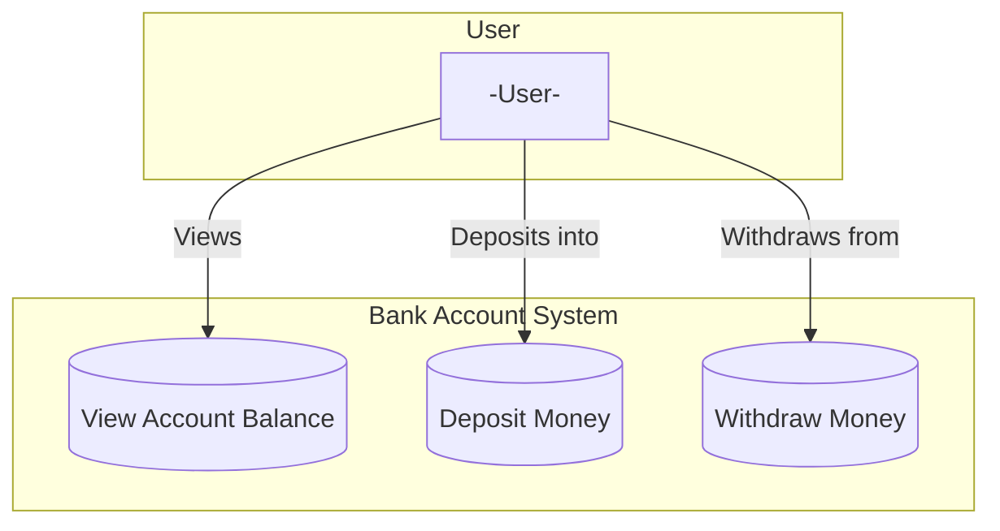

# Use Case Diagrams: Basic Concepts

Use case diagrams are used to identify the functionality provided by a system and the different users that interact with it.

# NOTE:
Mermaid does not have a specific type of diagram to represent use cases as traditional UML does. However, it is possible to simulate use cases using flowcharts in Mermaid to represent actors and interactions with system use cases. 

## Use Case Diagram: Bank Account System with Flow Chart

## Explanation

- **User:** Represents a bank customer.
- **View Account Balance:** Allows the user to view their current account balance.
- **Deposit Money:** Allows the user to deposit money into their account.
- **Withdraw Money:** Allows the user to withdraw money from their account.

This is a very basic use case diagram, but it’s a great starting point to represent system functionalities and interactions.